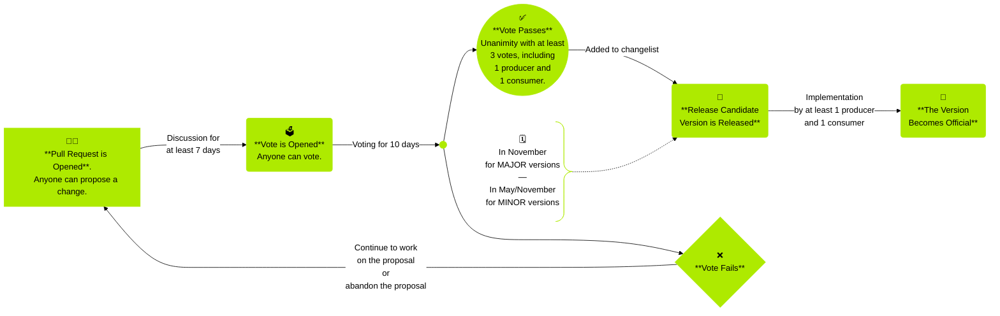

# Governance Process

The key words "MUST", "MUST NOT", "REQUIRED", "SHALL", "SHALL NOT", "SHOULD", "SHOULD NOT", "RECOMMENDED", "NOT RECOMMENDED", "MAY", and "OPTIONAL" in this document are to be interpreted as described in RFC2119, BCP 14 and RFC8174 when, and only when, they appear in all capitals, as shown here.

## **Overview**

GOFS is an open specification, developed and maintained by the community of producers and consumers of GOFS data. The specification is not fixed or unchangeable. As the shared mobility industry evolves, it is expected that the specification will be extended by the GOFS community to include new features and capabilities over time.

Changes to the specification (gofs.md) and the specification governance (governance.md) are subject to a vote using the process outlined below.

## **Maintainer Role**

The specification has a designated Maintainer. The Maintainer MAY be an individual, a group of individuals or an organization. The current Maintainer is MobilityData. The Maintainer role includes but is not limited to: reviewing PRs, maintaining documentation, facilitation and counting of votes, merging successful proposals, managing releases and their Version Release Cycles. The current Git repository is the GOFS Github repository. The current Slack channel is the \#gofs channel on the MobilityData Slack.

## **Change Process**

To manage the change process, the following guidelines have been established.

* Anyone can propose a change.  
* A change is proposed by opening a Pull Request (PR) at the GOFS Git repository. The proposer becomes "The Advocate". Comments and feedback from the GOFS community are received to iterate on the proposed change. Discussion lasts for as long as necessary to address questions and revisions, but MUST be at least 7 calendar days.  
* After 7 calendar days, The Advocate or the Maintainer MAY call for a vote. Should The Advocate not call a vote or respond to comments from the community for a period of 30 full calendar days, anyone in the community MAY call for a vote.  
* The voting period MUST last the minimum period sufficient to cover 10 full calendar days. Voting ends at 23:59:59 UTC.  
* The vote announcement on the Pull Request SHOULD conform to this template:  
  * *I hereby call a vote on this proposal. Voting will be open for 10 full calendar days until 11:59PM UTC on X.*  
    *Please vote for or against the proposal, and include the organization for which you are voting in your comment.*

  *Please note if you can commit to implementing the proposal.*  
* The person calling for the vote SHOULD announce the vote in the Slack channel with a link to the PR. The message SHOULD conform to this template:  
  * *A vote has been called on PR \# \[title of PR\] (link to PR). This vote will be open for 10 full calendar days, until 11:59PM UTC on X. Please vote for or against the proposal on GitHub.*  
* When there are 2 calendar days remaining on the vote, the Maintainer SHOULD comment on the PR on the Git repository and send a reminder in the Slack channel. The reminder SHOULD conform to this template:  
  * Slack:  
    *Voting on PR \# \[title of PR\] (link to PR) closes in 2 calendar days. Please vote for or against the proposal on GitHub.*  
  * Git repository:  
    *Voting on this PR closes in 2 calendar days. Please vote for or against the proposal, and include the organization for which you are voting in your comment. Please note if you can commit to implementing the proposal.*  
* Once a vote is called, a "Vote Open" label SHOULD be added to the PR. After the 2 day reminder, the label SHOULD be replaced with "Vote Closing Soon". Once the vote is closed, the label SHOULD be replaced with "Vote Passed" or "Voted Failed" depending on the vote outcome.  
* A vote passes if there is unanimous consensus with at least 2 votes in favor.  
  * Anyone can vote.  
  * Votes from multiple members of the same organization are counted as one vote.  
  * At least one of the votes MUST be from a producer and at least one MUST be from a consumer.  
  * The Maintainer serves as facilitator but does not vote on proposed changes.  
  * Votes against a proposal stop a proposal from passing if a specific reason for voting against is provided. The votes against MUST contain a justifying text highlighting the reasoning behind the decision. The justifying text SHOULD include an alternative solution and/or next steps.  
  * During the voting period only editorial changes to the proposal are allowed. An editorial change is a change to grammar, punctuation, formatting or sentence structure.  
* The Advocate MUST cancel the vote and restart the voting process if significant changes to the proposal are needed after stakeholders have voted. A significant change is a change to the field name, function, or requirement level.  
  * If it becomes necessary to cancel a vote, the Advocate in consultation with the community MAY decide if it is necessary to reopen the discussion period before calling another vote.  
* Should the vote fail, The Advocate MAY choose to continue work on the proposal with the feedback received and restart the voting process, or abandon the proposal by closing the Pull Request. Another interested member of the community, or the Maintainer, MAY take over the proposal if they feel the addition is valuable.  
* When a vote passes, the change is ready to become part of a Release Candidate (RC). The Maintainer, in consultation with the community, MAY determine the frequency of Release Candidates.  
* Changes remain in RC status pending implementation.  
  * Implementation requirements are that at least 1 producer and 1 consumer implement the changes contained in the RC.  
  * Once implemented successfully, the Release Candidate becomes an official current release.  
  * The Maintainer SHOULD track the implementation of changes. Changes that have not met the implementation requirements MAY be removed from a Release Candidate so that successfully implemented parts of the Release Candidate can become an official release. Any changes that are removed MAY become part of a future Release Candidate.  
* Editorial changes and corrections do not need to be voted on. Extensions that include new capabilities and features, or changes to the definition of existing fields MUST be voted on.  
* Issues and Pull Requests are considered stale after 60 days, at which point participants are notified via comment. Should they wish to keep the discussion open, it is the responsibility of the participants to re-engage in the conversation. If there is no re-engagement, the issue or Pull Request will be closed 30 days after the stale date.

## **Version Release Cycles**

* MAJOR releases are limited to no more than once a 12 month period. Multiple breaking changes SHOULD be batched together into a single release every 12 months.  
* MINOR releases are limited to no more than once a 6 month period. Multiple non breaking changes SHOULD be batched into a single release every 6 months. Non breaking changes MAY be batched into a MAJOR release.  
* The current release cycle is:  
  * MINOR versions SHOULD be released every May by the Maintainer. Voting for a MINOR version SHOULD be complete by April 30th.  
  * MAJOR versions SHOULD be released every November by the Maintainer. Voting for a MAJOR version SHOULD be complete by October 31st.  
  * In the event that there is no MAJOR version release for the period, a MINOR version MAY be released in November.

| Key Dates | Period |
| :---- | :---- |
| April 30th | Vote Deadline |
| May | MINOR Version Release |
| October 31st | Vote Deadline |
| November | MINOR or MAJOR Version Release |
| Else | Discussion and Voting |
